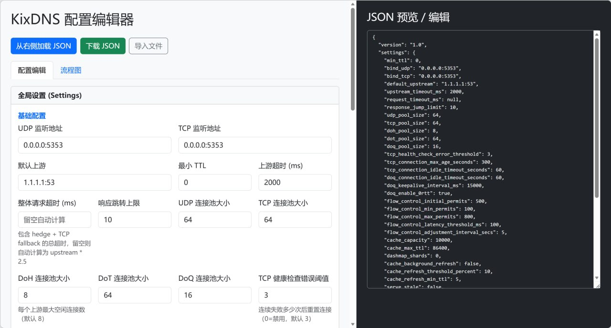

# KixDNS

**[English](./README.md)** | **[简体中文](./README.zh-CN.md)**

> **注意：本项目完全由 AI 构建（内容、文档与初始实现均由 AI 生成）。**

KixDNS 是使用 Rust 编写的异步、非递归 DNS 转发服务器。它接收 UDP/TCP 查询，也可以启用入站 DoH，然后按照有序的 Pipeline 规则进行转发或直接构造响应。

本文档以当前 main 分支代码为准。配置类型可以反序列化但运行引擎尚未读取的字段会明确标注。

## 特性

### 🚀 高性能

- **零拷贝 UDP 处理** — 基于 `BytesMut` 的数据包处理，尽量减少内存复制。
- **延迟请求解析** — 不需要匹配解析字段时，转发路径可以避免完整反序列化。
- **轻量响应扫描** — 提取缓存和响应规则所需的响应元数据。
- **快速哈希** — 适用的内部数据结构使用 `rustc-hash`（FxHash）。
- **异步 I/O** — 基于 `tokio`，并使用 `DashMap` 与 `moka` 管理并发状态。
- **按 worker 管理 UDP socket** — Unix worker 使用平台 reuse-port 能力；非 Unix 构建共享一个 UDP socket。

### 🔧 灵活路由

- **Pipeline 选择规则** — 支持按监听器标签、客户端 IP、域名、QCLASS、EDNS、GeoIP、GeoSite 和查询类型路由。
- **匹配器逻辑运算** — 使用 `and`、`or`、`and_not`、`or_not`、`not` 组合有序匹配链。
- **两阶段处理** — 请求匹配之后可以继续进行响应匹配和响应动作处理。
- **监听器标签** — 同一服务实例可以选择不同 Pipeline。
- **多种上游传输** — UDP、TCP、TCP+UDP、DoH（RFC 8484）、DoT 和 DoQ（RFC 9250）。
- **URL 协议前缀** — 使用 `udp://`、`tcp://`、`doh://`、`dot://` 和 `doq://` 选择传输方式。
- **EDNS Client Subnet（RFC 7871）** — Pipeline 级缓存隔离与 Forward action 级请求改写。

### 💾 缓存与可靠性

- **内存缓存** — 支持配置容量、最大生存时间、最小 TTL 和过期缓存服务行为。
- **并发未命中去重** — 相同的进行中缓存未命中共享一次上游操作。
- **后台刷新** — 接近过期的条目可以异步刷新。
- **Serve Stale（RFC 8767）** — 可选在上游访问失败时返回过期缓存条目。

### 🌍 GeoIP、GeoSite 与 DoQ

- **MaxMind GeoIP** — 支持 MMDB 查询以及国家和私有 IP 匹配器。
- **V2Ray GeoSite** — 加载 `.dat` 或支持的 JSON 文件，用于域名分类匹配。
- **数据库重载** — 配置的 GeoSite 文件和 GeoIP `.dat` 文件会被监控并重载。
- **DoQ 0-RTT 处理** — 支持全局和单上游配置；拒绝或超时后会回退，直到进程重启。

### 📊 运维

- **配置热重载** — 有效 JSON 变更会通过文件 watcher 重载；无效变更保留之前的配置。
- **结构化 tracing** — 默认输出文本，过滤级别由 `--debug` 和 `RUST_LOG` 控制。
- **GeoIP 转换** — 可通过命令行将 V2Ray GeoIP `.dat` 转换为 MMDB。

## 当前实现

- 入站 DNS over UDP 和 TCP。
- 可选的入站 DNS over HTTPS（DoH，RFC 8484），使用 PEM 证书和私钥。
- 出站 UDP、TCP、TCP+UDP 对冲请求、DoH、DoT 和 DoQ。
- 按顺序进行 Pipeline 选择和请求规则匹配。
- 支持监听器标签、客户端地址、域名、查询类型/类别、EDNS、GeoIP 和 GeoSite 的请求匹配器。
- 支持响应匹配器，以及上游回退、响应过滤、响应替换和响应阶段 Pipeline 跳转。
- 内存 DNS 缓存：容量、最大生存时间、最小 TTL、并发未命中去重、后台刷新和可选的 RFC 8767 过期缓存。
- ECS 请求改写（RFC 7871），以及可选的 Pipeline 级 ECS 缓存隔离。
- MaxMind MMDB GeoIP 查询，以及 V2Ray GeoIP/GeoSite 数据加载。
- 主 JSON 配置、GeoSite 文件和配置的 GeoIP .dat/JSON 文件的文件监控。
- GeoIP .dat 转 MMDB 的命令行工具。

Unix 构建会为 UDP worker 创建独立 socket，并使用平台提供的 reuse-port 能力；非 Unix 构建使用由多个 worker 共享的 UDP socket。这是实现细节，不代表固定吞吐承诺。

## 快速开始

> 💡 **第一次配置 KixDNS？** 可以使用 **[可视化配置编辑器](#配置编辑器)**，在浏览器中生成 `pipeline.json`。

### 构建和运行

仓库使用 Rust edition 2024。项目没有声明 MSRV，请使用支持 edition 2024 的工具链。

~~~bash
cargo build --release

# 不带子命令：使用 config/pipeline.json 和默认 listener label
./target/release/kixdns

# 显式使用 run 子命令
./target/release/kixdns run -c config/pipeline.json
~~~

UDP 和 TCP 默认监听 0.0.0.0:5353，默认上游是 1.1.1.1:53。所有路径都会按原样传给文件系统；相对路径相对于进程工作目录。

### CLI

~~~text
kixdns [COMMAND]

COMMANDS:
  run              运行 DNS 服务器
  convert-geo-ip   将 GeoIP .dat 转换为 MMDB
  help             显示帮助
~~~

run 选项：

~~~text
-c, --config <FILE>             配置路径（默认：config/pipeline.json）
    --listener-label <LABEL>    Pipeline 选择使用的监听器标签（默认：default）
    --debug                     启用 debug 级别日志
    --udp-workers <NUM>         UDP worker 数量（0 表示使用可用 CPU 并行度）
-h, --help                      显示帮助
-V, --version                   显示版本
~~~

GeoIP 转换选项：

~~~text
-i, --input <FILE>              输入 V2Ray GeoIP .dat 文件
-o, --output <FILE>             输出 MMDB 文件
-f, --filter <CODES>            逗号分隔的国家代码，例如 CN,US,JP
~~~

日志订阅器默认输出文本。默认过滤级别是 error；--debug 或 RUST_LOG 环境变量可以改变它。代码没有配置 JSON 日志输出。

### systemd

创建 /etc/systemd/system/kixdns.service：

~~~ini
[Unit]
Description=KixDNS
After=network.target

[Service]
Type=simple
ExecStart=/usr/local/bin/kixdns run -c /etc/kixdns/pipeline.json
Restart=on-failure
LimitNOFILE=65536

[Install]
WantedBy=multi-user.target
~~~

~~~bash
sudo install -m 0755 target/release/kixdns /usr/local/bin/kixdns
sudo mkdir -p /etc/kixdns
sudo cp config/pipeline.json /etc/kixdns/
sudo systemctl daemon-reload
sudo systemctl enable --now kixdns
~~~

## 网络协议

### 入站

UDP 和 TCP 监听器分别由 settings.bind_udp 和 settings.bind_tcp 创建。

只有设置 settings.bind_doh 后才会启用入站 DoH。启用时必须同时设置 settings.doh_tls_cert 和 settings.doh_tls_key，且路径指向 PEM 文件。路径默认为 /dns-query，可通过 settings.doh_path 修改。

入站 DoH 处理器：

- 接收配置路径上的 POST 请求，并读取 DNS wire message 请求体；
- 接收配置路径上的 GET 请求，并读取 dns 查询参数中的无填充 base64url 数据；
- 拒绝大于 64 KiB 的 DNS 请求体；
- 成功处理后返回 application/dns-message。

DoT 和 DoQ 只作为出站传输实现，代码没有入站 DoT/DoQ 监听器。

### 出站

Forward 动作的 transport 字段可选以下值：

| 值 | 传输 |
|---|---|
| udp | DNS over UDP |
| tcp | DNS over TCP |
| tcp_udp | 同时发送 TCP 和 UDP，使用第一个可接受的响应 |
| doh | DNS over HTTPS |
| dot | DNS over TLS |
| doq | DNS over QUIC |

upstream 支持字符串、逗号分隔字符串或 JSON 字符串数组。多个上游会并发查询并返回第一个可接受的响应；在多个上游选择时，SERVFAIL 和 REFUSED 响应不会被接受。

以下协议前缀会覆盖 transport 字段：

| 前缀 | 传输 | 别名 |
|---|---|---|
| udp:// | UDP | |
| tcp:// | TCP | |
| tcp+udp://、udp+tcp:// | TCP+UDP | |
| doh:// | DoH | https:// |
| dot:// | DoT | tls:// |
| doq:// | DoQ | quic:// |

没有协议前缀时，省略 transport 默认为 UDP。没有路径的 DoH URL 使用 /dns-query。DoH 支持使用 host 查询参数覆盖 HTTP Host；该参数不会继续发送给上游。

DoT 未提供端口时使用 853。可通过 sni 或 servername 查询参数设置 TLS 名称，且 DoT 上游不能包含 DNS path。

DoQ 未提供端口时使用 853。可通过 sni/servername 和 0rtt/enable_0rtt 查询参数配置。使用 IP 字面量的 DoQ 上游必须显式设置 SNI。0-RTT 默认全局启用，也可以按上游覆盖；某个上游被拒绝或超时后，会在进程重启前对该上游禁用 0-RTT。

UDP 转发失败或 UDP 响应被截断时，TCP fallback 默认启用，可通过 settings.enable_tcp_fallback 禁用。该 fallback 属于转发路径，不是额外监听器。

## 配置

配置格式为 JSON：

~~~json
{
  "version": "1.0",
  "settings": {},
  "pipeline_select": [],
  "pipelines": []
}
~~~

version 可省略。settings、pipeline_select 和 pipelines 省略时分别使用默认/空值。没有 Pipeline selector 匹配时使用第一个 Pipeline；没有 Pipeline 时使用全局默认上游。

### 全局设置

| 字段 | 默认值 | 说明 |
|---|---:|---|
| min_ttl | 0 | 上游/缓存 TTL 下限，单位秒。 |
| bind_udp | 0.0.0.0:5353 | UDP 监听地址。 |
| bind_tcp | 0.0.0.0:5353 | TCP 监听地址。 |
| bind_doh | null | 入站 DoH 监听地址；null 表示禁用。 |
| doh_tls_cert | null | PEM 证书路径；设置 bind_doh 时必需。 |
| doh_tls_key | null | PEM 私钥路径；设置 bind_doh 时必需。 |
| doh_path | /dns-query | 入站 DoH 请求路径。 |
| default_upstream | 1.1.1.1:53 | 默认上游；支持逗号分隔列表。 |
| upstream_timeout_ms | 9000 | 单次上游操作超时。 |
| request_timeout_ms | null | 整体请求超时；为 null 时使用 upstream_timeout_ms * 2.5，且不能小于 upstream_timeout_ms。 |
| response_jump_limit | 10 | 响应阶段 Pipeline 跳转上限。 |
| udp_pool_size | 64 | 出站 UDP socket 池大小。 |
| tcp_pool_size | 64 | 每个上游的 TCP 连接池大小。 |
| doh_pool_size | 8 | 每个上游最多保留的 DoH 空闲连接数。 |
| dot_pool_size | 64 | 每个上游的 DoT 连接池大小。 |
| doq_pool_size | 16 | 每个上游的 DoQ 连接池大小。 |
| tcp_health_check_error_threshold | 3 | 连续错误达到该次数后重置 TCP/DoT 连接；0 禁用。 |
| tcp_connection_max_age_seconds | 300 | TCP/DoT 连接最大存活时间；0 禁用。 |
| tcp_connection_idle_timeout_seconds | 60 | TCP/DoT 空闲超时；0 禁用。 |
| doq_connection_idle_timeout_seconds | 60 | DoQ 空闲超时；0 禁用。 |
| doq_keepalive_interval_ms | 15000 | DoQ keepalive 间隔；0 禁用。 |
| doq_enable_0rtt | true | 全局 DoQ 0-RTT 设置。 |
| enable_tcp_fallback | true | UDP 失败或截断时用 TCP 重试。 |
| flow_control_enabled | false | 启用基于 permits 的自适应流控。 |
| flow_control_initial_permits | 500 | 启用流控时的初始 permits。 |
| flow_control_min_permits | 100 | 启用流控时的最小 permits。 |
| flow_control_max_permits | 800 | 启用流控时的最大 permits。 |
| flow_control_latency_threshold_ms | 100 | 自适应流控使用的延迟阈值。 |
| flow_control_adjustment_interval_secs | 5 | permits 调整间隔。 |
| cache_capacity | 10000 | DNS 响应缓存最大条目数；必须大于 0。 |
| cache_max_ttl | 86400 | DNS 缓存条目的最大生存时间，单位秒。 |
| dashmap_shards | 0 | 内部分片设置；0 使用 DashMap 默认值，否则必须是 2 的幂。 |
| cache_background_refresh | false | 在 TTL 过期前刷新条目。 |
| cache_refresh_threshold_percent | 10 | 按剩余 TTL 百分比触发刷新。 |
| cache_refresh_min_ttl | 5 | 参与后台刷新的最小 TTL。 |
| serve_stale | false | 按 RFC 8767 行为保留并返回过期条目。 |
| serve_stale_ttl | 30 | 过期响应中写入的 TTL。 |
| serve_stale_expire_ttl | 86400 | 允许返回过期条目的最大时间，单位秒；0 表示不限制过期时间。 |
| serve_stale_ttl_reset | true | 返回过期数据时重置过期时间窗口。 |
| serve_stale_client_timeout_ms | 0 | 0 表示立即返回过期数据；大于 0 时先尝试上游指定毫秒数。 |
| geoip_db_path | null | MaxMind MMDB 路径。 |
| geoip_dat_path | null | V2Ray GeoIP .dat 或支持的 V2Ray JSON 路径；当前范围加载器使用 IPv4 范围。 |
| geosite_data_paths | [] | V2Ray GeoSite .dat 或 JSON 路径列表；支持多个文件。 |

当前配置类型会反序列化 geoip_auto_convert 和 geoip_filter_countries，但运行引擎没有读取它们，因此它们不会改变运行行为。转换时的国家过滤请使用 convert-geo-ip 的 --filter。顶层 background_refresh_rule 也会被读取，但当前运行时配置编译会忽略它。

### Pipeline 选择

pipeline_select 的每项包含 Pipeline id、可选的匹配器列表和可选的 matcher_operator。数组按顺序评估；第一个匹配且 id 存在的项选择对应 Pipeline。

### Pipeline 和规则

每个 Pipeline 包含 id、可选的 rules 数组和可选的 Pipeline 级 ecs。规则按配置顺序处理。空匹配器列表视为匹配。规则内的匹配器按从左到右形成链；每个匹配器可以携带自己的 operator，或者在所有匹配器都省略 operator 时由规则级 matcher_operator 设置。

响应阶段使用同样的 response_matchers、response_matcher_operator、response_actions_on_match 和 response_actions_on_miss。Forward 得到响应后执行响应动作；配置了 miss 动作时，上游尝试全部失败后也会进入 miss 路径。

### Pipeline selector 和请求匹配器

| 类型 | 字段 |
|---|---|
| any | 无 |
| listener_label | value |
| client_ip | cidr |
| domain_suffix | value |
| domain_regex | value |
| qclass | value：IN、CH/CHAOS 或 HS |
| edns_present | expect：布尔值 |
| geosite | value：GeoSite tag |
| geosite_not | value：GeoSite tag |
| geoip_country | country_codes：字符串数组 |
| geoip_private | expect：布尔值 |
| qtype | value：A、AAAA、CNAME、MX、TXT、NS、PTR、SOA、SRV 或 OPT |

Pipeline selector 支持上表全部类型；请求规则支持除 listener_label 之外的全部类型。

域名后缀和 GeoSite 匹配不区分大小写。domain_regex 和 request_domain_regex 使用 Rust 正则语法。

### 响应匹配器

| 类型 | 字段 |
|---|---|
| upstream_equals | value；按运行时上游标签做字符串精确比较 |
| request_domain_suffix | value |
| request_domain_regex | value |
| response_upstream_ip | cidr；支持逗号分隔 CIDR |
| response_answer_ip | cidr；支持逗号分隔 CIDR |
| response_type | value；优先检查第一个 Answer 记录，没有 Answer 时使用查询类型 |
| response_rcode | value：NOERROR、FORMERR、SERVFAIL、NXDOMAIN、NOTIMP、REFUSED；未知值作为 OTHER 回退匹配 |
| response_qclass | value |
| response_edns_present | expect：布尔值 |
| response_answer_ip_geoip_country | country_codes：字符串数组 |
| response_answer_ip_geoip_private | expect：布尔值 |
| response_request_domain_geosite | value：GeoSite tag |
| response_request_domain_geosite_not | value：GeoSite tag |
| response_txt_content | mode：exact、prefix 或 regex；value 为文本/模式 |

当前成功上游标签包含传输前缀，例如 udp:1.1.1.1:53 或 tcp:1.1.1.1:53。因此 upstream_equals 的 value 必须包含该前缀。response_upstream_ip 当前解析原始 IP 或 host:port，不会剥离传输前缀。

### 逻辑运算符

运算符从左到右计算，第一个匹配器作为初始结果。

| 运算符 | 含义 |
|---|---|
| and | 下一个匹配器必须为 true，默认值。 |
| or | 累积结果为 false 时，使用下一个匹配器结果。 |
| and_not | 累积结果为 true 时，下一个匹配器必须为 false。 |
| or_not | 累积结果为 false 时，下一个匹配器必须为 false。 |
| not | 反序列化时作为 and_not 的别名。 |

同时接受 and-not、andnot、or-not 和 ornot 别名。

### 动作

| 类型 | 字段 | 行为 |
|---|---|---|
| log | level（可选） | 输出匹配规则的 tracing 事件；支持 trace、debug、info、warn、error。 |
| static_response | rcode | 返回 NOERROR、FORMERR、SERVFAIL、NXDOMAIN、NOTIMP 或 REFUSED。 |
| static_ip_response | ip | 根据 IP 地址返回 A 或 AAAA 响应。 |
| static_txt_response | text、ttl（可选） | 返回 TXT 响应；text 支持字符串或字符串数组，ttl 默认 300。 |
| jump_to_pipeline | pipeline | 开始处理指定 Pipeline。 |
| allow | 无 | 请求阶段：使用全局默认 UDP 上游；响应阶段：保留当前上游响应。 |
| deny | 无 | 返回 REFUSED。 |
| forward | upstream（可选）、transport（可选）、ecs（可选） | 转发到指定上游；缺少 upstream 时使用 default_upstream。 |
| continue | 无 | 继续处理下一个请求规则，或继续响应流程中的下一个 Pipeline 决策。 |
| replace_txt_response | text | 响应阶段替换当前响应中的 TXT 记录；请求阶段不会产生响应。 |

### ECS

ECS 配置在 Forward 动作中：

~~~json
{
  "type": "forward",
  "upstream": "8.8.8.8:53",
  "ecs": {
    "mode": "from_client_ip",
    "prefix_v4": 24,
    "prefix_v6": 56
  }
}
~~~

支持的模式：

- clear：移除请求中的 ECS 选项；
- from_client_ip：根据客户端地址生成子网，IPv4 默认 /24、IPv6 默认 /56；私有地址、回环地址和 ULA 地址不会注入；
- static：使用配置的 IP 和前缀注入。

Pipeline 级 ecs 会改变缓存键，使不同客户端子网的响应可以隔离；它不会替代 Forward 动作的 ECS 改写设置。当 action 使用 ECS 但 Pipeline 没有 ecs 时，运行引擎会发出警告。

## 配置示例

### 基本路由和静态响应

~~~json
{
  "version": "1.0",
  "settings": {
    "bind_udp": "0.0.0.0:5353",
    "bind_tcp": "0.0.0.0:5353",
    "default_upstream": "1.1.1.1:53"
  },
  "pipeline_select": [
    {
      "pipeline": "internal",
      "matchers": [
        { "type": "listener_label", "value": "edge-internal" }
      ]
    }
  ],
  "pipelines": [
    {
      "id": "internal",
      "rules": [
        {
          "name": "internal-dns",
          "matchers": [
            { "type": "domain_suffix", "value": ".internal" }
          ],
          "actions": [
            { "type": "forward", "upstream": "10.0.0.53:53", "transport": "tcp" }
          ]
        }
      ]
    },
    {
      "id": "default",
      "rules": [
        {
          "name": "block-example",
          "matchers": [
            { "type": "domain_suffix", "value": ".blocked.example" }
          ],
          "actions": [
            { "type": "static_response", "rcode": "NXDOMAIN" }
          ]
        },
        {
          "name": "default-forward",
          "matchers": [ { "type": "any" } ],
          "actions": [
            { "type": "forward", "upstream": null }
          ]
        }
      ]
    }
  ]
}
~~~

### 响应阶段回退

~~~json
{
  "settings": {
    "default_upstream": "223.5.5.5:53"
  },
  "pipelines": [
    {
      "id": "fallback",
      "rules": [
        {
          "name": "reject-polluted-answer",
          "matchers": [ { "type": "any" } ],
          "actions": [
            { "type": "forward", "upstream": "223.5.5.5:53", "transport": "udp" }
          ],
          "response_matchers": [
            { "type": "response_answer_ip", "cidr": "127.0.0.0/8,0.0.0.0/8" }
          ],
          "response_actions_on_match": [
            { "type": "continue" }
          ],
          "response_actions_on_miss": [
            { "type": "allow" }
          ]
        },
        {
          "name": "backup",
          "matchers": [ { "type": "any" } ],
          "actions": [
            { "type": "forward", "upstream": "8.8.4.4:53", "transport": "tcp" }
          ]
        }
      ]
    }
  ]
}
~~~

### 入站 DoH

~~~json
{
  "settings": {
    "bind_doh": "0.0.0.0:8443",
    "doh_tls_cert": "/etc/kixdns/cert.pem",
    "doh_tls_key": "/etc/kixdns/key.pem",
    "doh_path": "/dns-query"
  },
  "pipelines": [
    {
      "id": "default",
      "rules": [
        {
          "name": "forward-all",
          "matchers": [ { "type": "any" } ],
          "actions": [ { "type": "forward", "upstream": "1.1.1.1:53" } ]
        }
      ]
    }
  ]
}
~~~

## 缓存和重载行为

DNS 响应缓存使用上游响应的最小 TTL；配置 min_ttl 时会将其提高到该下限，并受 cache_max_ttl 和 cache_capacity 限制。否定响应在存在 SOA 时使用 SOA 负缓存 TTL。相同的进行中缓存未命中会共享一次上游操作。

启用 cache_background_refresh 后，接近过期的条目可以触发异步刷新；刷新失败会保留现有条目。启用 serve_stale 后，可以返回过期条目，并使用 serve_stale_ttl 作为响应 TTL，同时受 serve_stale_expire_ttl 和 serve_stale_client_timeout_ms 限制。

主配置 watcher 会重载有效 JSON 并清空规则缓存。无效的重载会保留旧配置。监听地址、UDP worker 数量、TLS DoH 监听器、连接池构造、缓存构造和其他 Engine 初始化参数均在启动时创建；修改这些设置后应重启服务。

geosite_data_paths 中的 GeoSite 文件会被监控并重载。geoip_dat_path 指定的 GeoIP 文件会被监控并重载。geoip_db_path 指定的 MMDB 在启动时加载；当前 watcher 监控的是 geoip_dat_path，不是 MMDB 路径。

## 技术栈

- **tokio** — 异步运行时
- **hickory-proto** — DNS 协议和 wire message
- **serde / serde_json** — 配置序列化
- **moka / dashmap** — 并发缓存和映射
- **rustc-hash** — 快速哈希
- **quinn** — QUIC/DoQ 传输
- **reqwest / hyper** — HTTP 和 DoH 客户端/服务端
- **tokio-rustls / rustls** — DoT、DoQ 和入站 DoH 的 TLS
- **maxminddb / maxminddb-writer** — GeoIP MMDB 查询和转换
- **arc-swap / notify** — 配置状态和文件监控
- **clap / tracing** — CLI 解析和日志

## 工具

### 配置编辑器

tools/config_editor.html 是浏览器端配置编辑器，可以编辑 settings、Pipeline selector、Pipeline、规则、匹配器、动作、ECS、TXT 动作和响应规则，支持导入 JSON、预览 JSON、下载 JSON 以及 Mermaid 流程图。

该文件从公共 CDN 加载 Vue、Bootstrap 和 Mermaid，因此浏览器需要能访问这些 URL。可以直接打开文件，导入或编辑配置，下载 JSON，然后通过启动 KixDNS 验证：

~~~text
tools/config_editor.html
~~~

工具专用说明见 [tools/README.md](tools/README.md)。

tools/diagnose.html 是用于检查编辑器 Vue/TXT/匹配器代码的浏览器 smoke-check 页面，不是 DNS 查询服务，也不提供 WebSocket API。

tools/check_geosite_tags.rs 是仓库中的独立源码文件。Cargo.toml 没有将它声明为 bin 或 example target。

## 构建和测试

~~~bash
cargo build --release
cargo test
cargo clippy --all-targets --all-features -- -D warnings
~~~

Release profile 设置 opt-level = 3、lto = fat、codegen-units = 1、panic = abort 和 strip = true。

主要依赖包括 tokio、hickory-proto、serde、moka、dashmap、reqwest、tokio-rustls、quinn、maxminddb、notify、clap 和 tracing；具体版本以 Cargo.toml 和 Cargo.lock 为准。

## 许可证

[GPL-3.0](LICENSE)
